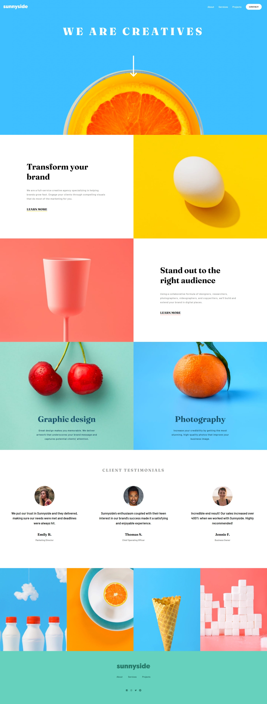

# Frontend Mentor - Sunnyside agency landing page solution

This is a solution to the [Sunnyside agency landing page challenge on Frontend Mentor](https://www.frontendmentor.io/challenges/sunnyside-agency-landing-page-7yVs3B6ef). Frontend Mentor challenges help you improve your coding skills by building realistic projects.

## Table of contents

- [Overview](#overview)
  - [The challenge](#the-challenge)
  - [Screenshot](#screenshot)
  - [Links](#links)
- [My process](#my-process)
  - [Built with](#built-with)
  - [What I learned](#what-i-learned)
  - [Continued development](#continued-development)
- [Author](#author)

## Overview

### The challenge

Users should be able to:

- View the optimal layout for the site depending on their device's screen size
- See hover states for all interactive elements on the page

### Screenshot

### Links

- Solution URL: [Github](https://github.com/doleetos/sunnyside)
- Live Site URL: [Live Site](https://doleetos.github.io/sunnyside/)

## My process

### Built with

- Semantic HTML5 markup
- CSS custom properties
- Flexbox
- CSS Grid
- Mobile-first workflow
- [React](https://reactjs.org/) - JS library

### What I learned

I decided to use ReactJS for this project since I just finished learning the basics of it.
This project took a hot minute to finish, but I am very satisfied with the result!
Also, it helped me settle and ground what I've been learning:
-JSX
-Components
-State hooks (Holy moly this one took QUITE SOME TIME to get the hang of it and really understand what's going on... :smiling_face_with_tear:)

### Continued development

I want to add more styles and components to make the website more interactive and user appealing.
Stay tuned for upcoming updates!

## Author

- Website - [Joanna Lee](https://github.com/doleetos)
- Frontend Mentor - [@doleetos](https://www.frontendmentor.io/profile/doleetos)
